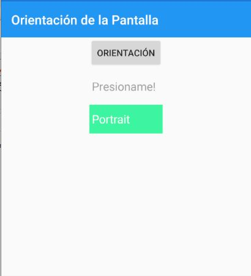
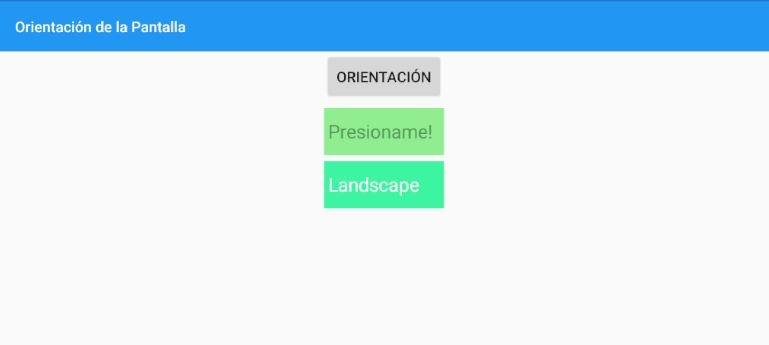

# XamarinDependencyServices
In this project I'm going to use concepts of more advance things about Xamarin, like Dependency services, Effects, Custom Renders and platform especifics

I used the DeviceOrientation interface, so when you click the button will display Portrait or LandsCape, depending of your phone's orientation.

As you can see, the first entry has an effect so when is focused changes its background color to green. In the other hand, the second one is a costum render, implemented in both android and ios projects.
